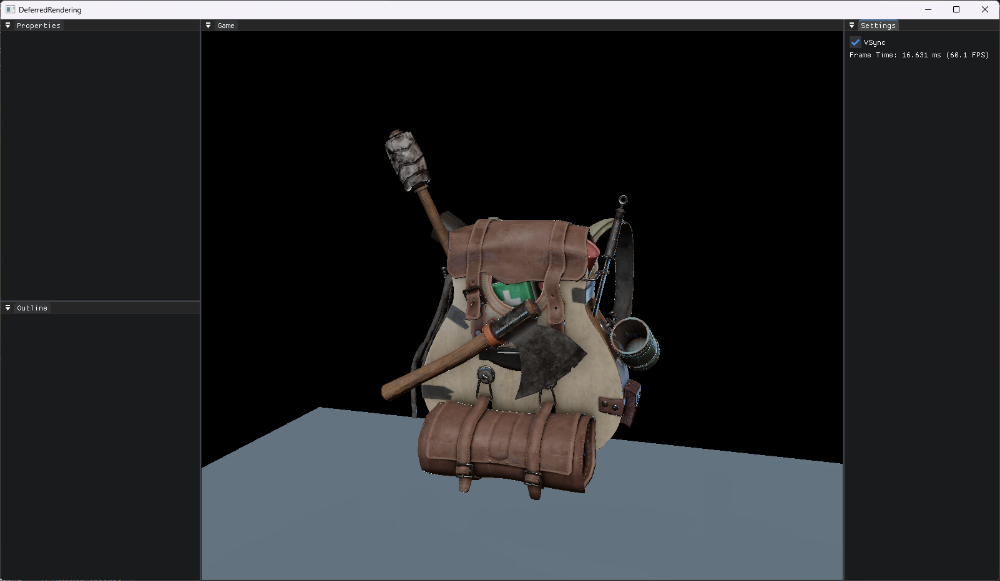

# DeferredRendering

PBR deferred renderer with material compilation pipeline and IBL environment lighting.



---

## Architecture Overview

Two projects form a pipeline:

```
┌─────────────────────────────────────────────────────────┐
│  ShaderCompiler (matc.exe)                              │
│  .mat → MaterialBuilder → ShaderGenerator → glslc → .matb│
└──────────────────────────┬──────────────────────────────┘
                           │ .matb (binary)
                           ▼
┌──────────────────────────────────────────────────────────┐
│  DeferredRendering (runtime)                             │
│  .matb → Material → MaterialInstance → GPU Program       │
│                                                          │
│  Render Pipeline:                                        │
│  GBuffer → Lighting → Sky → ToneMapping                  │
│                                                          │
│  IBL Pipeline (init):                                     │
│  HDR → ERP → Kernel → Irradiance + Prefilter              │
└──────────────────────────────────────────────────────────┘
```

---

## ShaderCompiler (matc.exe)

### Flow

```
.mat file (JSON or Block format)
  → MaterialCompiler::Run()
    → parseMaterial() → MaterialBuilder
    → configureBuilder() → includeCallback + spirvCompiler
    → builder.build()
      → prepareToBuild()     — UIB, SIB, mProperties
      → generateShaders()    — GLSL generation for each Pass
      → writeCommonChunks()  — descriptor sets, shading params
      → Serialize            — → Package (binary)
    → writeFile() → .matb + .vert/.frag
```

### Stage × Pass Matrix

|             | Depth | Surface | Lighting | PostProcess |
|-------------|-------|---------|----------|-------------|
| Vertex      | ✓     | ✓       | ✓        | ✓           |
| Fragment    | ✓     | ✓       | ✓        | ✓           |

- Deferred materials: **Depth + Surface** (depth prepass + GBuffer write)
- Lighting materials: **Lighting** only (fullscreen deferred shading)
- PostProcess materials: **PostProcess** only

### Descriptor Set Layout (per .matb)

| Set | Name | Typical Bindings |
|-----|------|-----------------|
| 0 | PER_VIEW | FrameUniforms UBO, LightData UBO, irradianceMap, prefilterMap, brdfLut |
| 1 | PER_RENDERABLE | ObjectUniforms UBO |
| 2 | PER_MATERIAL | MaterialParams UBO, material samplers |
| 3 | G_BUFFER | gDepth, gNormal, gAlbedo, gMaterial (lighting only) |

### Key Modules

| Module | File | Role |
|---|---|---|
| MaterialCompiler | `ShaderCompiler/MaterialCompiler.h/cpp` | Entry point, JSON/Block parsing, Run/Build/CompileLighting |
| MaterialBuilder | `Common/Material/MaterialBuilder.h/cpp` | Build pipeline: parameters → shaders → Package |
| ShaderGenerator | `ShaderCompiler/ShaderGenerator.h/cpp` | Stage×Pass GLSL generation with template system |
| CodeGenerator | `ShaderCompiler/CodeGenerator.h/cpp` | UBO, sampler, varying, macro emission |
| ParameterProcessor | `ShaderCompiler/ParameterProcessor.cpp` | JSON → MaterialBuilder callbacks (20+ keys) |
| ChunkContainer | `Common/Serialization/ChunkContainer.h` | Closure-based serialization, push<T>(Container) |
| MaterialChunks | `Common/Serialization/MaterialChunks.h` | All chunk types: Glsl, Spirv, UIB, SIB, descriptor sets, etc. |

### Material Format (.mat)

```
material {
    name: Model,
    pipeline: deferred,
    shadingModel: lit,
    vertexDomain: object,    // OBJECT | WORLD | VIEW | DEVICE
    requires: [POSITION, TANGENTS, UV0],
    parameters: [
      { type: sampler2d, name: baseColor },
      { type: sampler2d, name: normal }
    ],
    domain: surface
}
vertex { ... }
fragment { ... }
```

---

## DeferredRendering (Runtime)

### Render Pipeline

```
GBufferPass              LightingPass            SkyLightPass           ToneMappingPass
  ├─ Albedo (RGBA8)        reads GBuffer           reads GBuffer_Depth    reads LightMap
  ├─ Normal (RGBA16F)      writes LightMap          writes Sky_SceneColor  writes Final_SceneColor
  ├─ Material (RGBA8)      (HDR, RGBA16F)
  └─ Depth (Depth32F)
```

### IBL Pipeline (Init Phase)

```
HDR image (.hdr)
  → ERPPass              (equirect → cubemap, R11G11B10F)
  → KernelPass × 2       (irradiance cosine + prefilter GGX kernels)
  → CubeMapConvolution::RenderIrradiance   → IBL_IrradianceMap (32×32, RGBA16F)
  → CubeMapConvolution::RenderPrefilter ×5 → IBL_PreFilterMap   (256×256 mip chain, R11G11B10F)
```

- `BRDF_LUT` loaded from `Assets/textures/ibl_brdf_lut.png`
- Lighting shader evaluates IBL: `evaluateIBL()` in `surface_shading_lit.fs`

### Runtime Material Loading

```
CompiledMaterials/*.matb
  → MaterialLibrary::GetMaterial(name)
    → MaterialParser  → ChunkContainer::Deserialize
    → Material::Material(parser)
      → ChunkSpirv (SPIR-V blobs)
      → ChunkGlsl  (GLSL fallback)
      → ChunkDescriptorSetBindings + Layout
      → ChunkUib / ChunkSib (parameter metadata)
      → ChunkShading → m_Shading

GetProgram(Pass):
  1. Check cache
  2. SPIR-V → CreateProgram
  3. GLSL fallback → CreateProgram (auto-detected by GLDriver::CompileShader)
```

### Lighting Shader Architecture

```
surface_shading_main.fs
  ├─ GBuffer samplers (CodeGenerator auto-binding)
  ├─ IBL samplers (generateGlobalSamplers, explicit bindings 16-18)
  ├─ surface_shading_unlit.fs  → evaluateMaterialUnlit()
  └─ surface_shading_lit.fs    → evaluateMaterialLit()
       ├─ CalculateLighting_PBR() (direct lights)
       └─ evaluateIBL()         (irradiance + prefilter + BRDF LUT)
```

### Post-Process Pipeline

```
Material domain: postprocess
  → ShaderGenerator::GenPostProcessVS/FS
  → MaterialInstance → SetParameter → Commit → GetShader(PostProcess)
  → beginRenderPass → draw fullscreen quad → endRenderPass
```

Examples: ToneMapping, ERPPass, KernelPass, CubeMapConvolution, SkyLightPass

---

## Build

```
# ShaderCompiler
MSBuild ShaderCompiler.vcxproj /p:Configuration=Debug /p:Platform=x64
# Output: Binaries/x64/Debug/ShaderCompiler.exe

# Runtime
MSBuild DeferredRendering.vcxproj /p:Configuration=Debug /p:Platform=x64
# PreBuild event: compile all .mat + __lighting__ → CompiledMaterials/
```

## Directory Layout

```
├── Material/              .mat material definitions
├── Template/              GLSL shader templates
├── CompiledMaterials/     Build output (.matb, .vert, .frag)
├── Assets/
│   ├── textures/hdr/      HDR environment maps
│   ├── textures/          ibl_brdf_lut.png
│   └── objects/           Model JSON + textures
├── Source/
│   ├── ShaderCompiler/    matc (compiler)
│   ├── Common/Material/   MaterialBuilder, MaterialTypes, MaterialCommon
│   ├── Common/Serialization/  ChunkContainer, MaterialChunks, FArchive
│   ├── Material/          Material, MaterialInstance, MaterialLibrary
│   ├── RenderPass/        GBufferPass, LightingPass, SkyLightPass, ToneMapping
│   │                      ERPPass, KernelPass, CubeMapConvolution
│   ├── RHI/               Driver abstraction, GL backend, DescriptorSet
│   ├── Panel/             ImGui editor panels
│   └── Layers/            EditorLayer
├── Binaries/              Build output
└── Include/               BufferInterfaceBlock, SamplerInterfaceBlock
```

## Tech Stack

- C++17, MSVC v143, VS2022
- OpenGL 4.6 + SPIR-V (glslc from Vulkan SDK)
- Assimp 5.x, stb_image, glm, GLFW, ImGui
- Custom: Lexer/Parser, ShaderGenerator, ChunkContainer serialization
